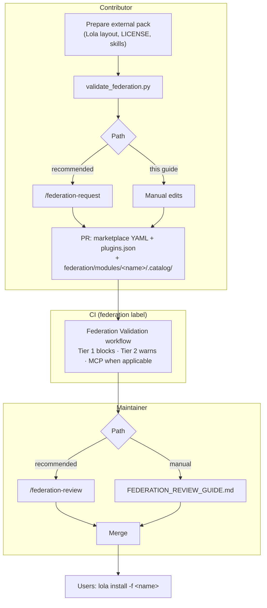

# Federation Request Guide

List your external Lola pack in the Red Hat Agentic Collections marketplace **without moving code into this repo**. Users install from your repository via [Lola](https://github.com/LobsterTrap/lola). Maintainer review: [FEDERATION_REVIEW_GUIDE.md](FEDERATION_REVIEW_GUIDE.md).

> **Install scope:** `lola install -f <name>` installs the **full pack** at `path` (same as in-repo modules). No per-skill subset in marketplace YAML.  
> **Lola `ref`:** Required here as a 40-character commit SHA for CI/catalog pinning. Lola ignores it at install until [lola#180](https://github.com/LobsterTrap/lola/issues/180).

## Process



| Skill | Role | When |
|-------|------|------|
| **`/federation-request`** | Contributor | Infer metadata from repo URL + pack path; prepare the PR |
| **`/create-collection`** | Contributor | Generate `federation/modules/<name>/.catalog/` from the external pack |
| **`/federation-review`** | Maintainer | Run checks and guide approval |
| **`/agentic-contribution-skill`** | Contributor | **Not federation** — add skills inside this repo ([CONTRIBUTING.md](CONTRIBUTING.md)) |

---

## Requirements

| Requirement | Details | CI |
|-------------|---------|-----|
| **Lola pack** | `CLAUDE.md`, `README.md`, `skills/` at declared `path` | Blocks |
| **License** | Apache-2.0–compatible LICENSE in your repo | Manual |
| **Tier 1** | [agentskills.io](https://agentskills.io/specification) linter | Blocks |
| **Tier 2** | [SKILL_DESIGN_PRINCIPLES.md](SKILL_DESIGN_PRINCIPLES.md) | **Warns** |
| **MCP** | If `mcps.json` has servers: pin images; `${ENV_VAR}` for secrets | Blocks when applicable |
| **Public repo + pinned `ref`** | Cloneable; 40-character commit SHA in marketplace entry | Blocks |

```bash
uv run python scripts/validate_federation.py <repo-url> --ref <40-char-sha>
uv run python scripts/validate_federation.py <repo-url> --ref <sha> --pack-path <path>
```

---

## Prepare the PR

**Inputs** (for `/federation-request`): public **repository** URL and pack **path** (`.` at repo root). Everything else is inferred from a clone — `name`, `title`, `description`, `version`, `ref`, `tags`; override before opening the PR. Default maturity: **`ORANGE`**.

**Three files to add or update:**

1. **`marketplace/rh-agentic-collection.yml`**

```yaml
  - name: "<name>"
    description: "<description>"
    version: "<version>"
    repository: "<repository>"
    ref: "<40-char-commit-sha>"
    path: "<path>"
    tags: ["<tag>", "federation"]
```

2. **`docs/plugins.json`** — `"<name>": { "title": "<human-readable title>" }`
3. **`federation/modules/<name>/.catalog/`** — catalog at `ref` (`id:` = module `name`)

```bash
git checkout -b feat/federate-<name>
git add marketplace/rh-agentic-collection.yml docs/plugins.json federation/modules/<name>/
git commit -m "feat: federate <name> module from <repository>"
gh pr create --title "feat: federate <name> module" --label "federation"
```

The **`federation`** label triggers CI. Full check list: [FEDERATION_REVIEW_GUIDE.md#checks](FEDERATION_REVIEW_GUIDE.md#checks).

---

## After merge

```bash
lola market add rh-agentic-collections https://raw.githubusercontent.com/RHEcosystemAppEng/agentic-collections/main/marketplace/rh-agentic-collection.yml
lola install -f <name>
```

**Updates:** bump `version` and `ref` (new SHA), refresh `.catalog/` if needed, open a PR with the `federation` label. Promotion to **`GREEN`** lists the pack on the [documentation site](https://rhecosystemappeng.github.io/agentic-collections).

---

## FAQ

| Question | Answer |
|----------|--------|
| Subset of skills from a larger repo? | Use a dedicated pack subdirectory; set `path` to it. |
| Private repo or monorepo? | Public only; monorepos OK via `path`. |
| Tag instead of SHA for `ref`? | No — use `git rev-parse <tag>` and pin the SHA. |
| Federation vs direct contribution? | Federation = external pack; direct = skills in this repo via `/agentic-contribution-skill`. |

## Resources

- [FEDERATION_REVIEW_GUIDE.md](FEDERATION_REVIEW_GUIDE.md) · [CONTRIBUTING.md](CONTRIBUTING.md) · [SKILL_DESIGN_PRINCIPLES.md](SKILL_DESIGN_PRINCIPLES.md) · [COLLECTION_SPEC.md](COLLECTION_SPEC.md) · [Lola](https://github.com/LobsterTrap/lola)
