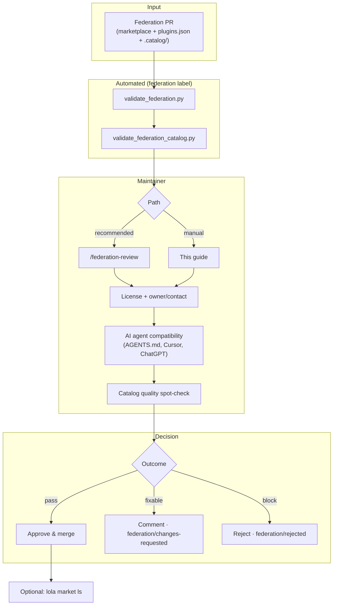

# Federation Review Guide

Evaluate federation PRs that list an **external Lola pack** in our catalog. Code stays in the contributor's repo; users install via [Lola](https://github.com/LobsterTrap/lola). Contributors: [FEDERATION_REQUEST_GUIDE.md](FEDERATION_REQUEST_GUIDE.md).

> **Lola `ref`:** Required here as a 40-character commit SHA for CI/catalog pinning. Lola ignores it at install until [lola#180](https://github.com/LobsterTrap/lola/issues/180).

## Review process



End-to-end contributor flow: [FEDERATION_REQUEST_GUIDE.md#process](FEDERATION_REQUEST_GUIDE.md#process).

---

## Checks

| Check | Blocks merge? | Automated | Tool |
|-------|---------------|-----------|------|
| Public access + valid `ref` SHA | Yes | Yes | `validate_federation.py` |
| Lola module schema | Yes | Yes | `validate_federation.py` |
| Tier 1 (agentskills.io) | Yes | Yes | `validate_federation.py` |
| Tier 2 (design principles) | **No** — warns | Yes | `validate_federation.py` |
| MCP pinning + credentials | Yes when applicable | Yes | `validate_federation.py` |
| Credential scan (gitleaks) | Yes | Yes | `validate_federation.py` |
| Catalog cross-check | Yes | Yes | `validate_federation_catalog.py` |
| License (Apache-2.0–compatible) | Yes | No | Manual |
| AI agent compatibility | Yes | No | Manual |
| LLM security scan | On-demand | No | Maintainer-triggered |

CI workflow: `.github/workflows/federation-validation.yml` — runs on PRs with the **`federation`** label only; posts a summary comment.

---

## Run validation

```bash
# Pack validation (same as CI)
uv run python scripts/validate_federation.py <repo-url> --ref <40-char-sha>
uv run python scripts/validate_federation.py <repo-url> --ref <sha> --pack-path <path> --json

# Catalog + marketplace alignment (when PR includes federation/modules/<name>/.catalog/)
uv run python scripts/validate_federation_catalog.py \
  --module-name <name> \
  --repo-url <repo-url> \
  --ref <sha> \
  --pack-path <path> \
  --module-json '<marketplace-module-json>'
```

**Manual spot-checks** (not fully automated):

- [ ] Owner/contact provided on the PR or issue
- [ ] LICENSE in external repo is Apache-2.0–compatible
- [ ] Declared agents supported (`AGENTS.md` routing, Cursor/ChatGPT config as claimed)
- [ ] Destructive skill operations require human confirmation
- [ ] Full pack at `path` is appropriate — no per-skill subset in marketplace YAML

Clone at pinned commit when inspecting by hand:

```bash
git clone --no-checkout <repo-url> /tmp/federation-review
cd /tmp/federation-review && git checkout <commit-sha>
# ... inspect skills/, mcps.json, AGENTS.md ...
rm -rf /tmp/federation-review
```

---

## Decision

| Result | Action |
|--------|--------|
| All required checks pass | Approve and merge the PR |
| Minor issues | Request specific fixes; label `federation/changes-requested` |
| Major issues | Reject with explanation; label `federation/rejected` |

---

## After merge

Verify listing (replace `main` with PR branch to test pre-merge):

```bash
MARKET="federation-review-$(openssl rand -hex 4)"
lola market add "$MARKET" https://raw.githubusercontent.com/RHEcosystemAppEng/agentic-collections/main/marketplace/rh-agentic-collection.yml
lola market ls "$MARKET"
lola market rm "$MARKET"
```

## Resources

- [FEDERATION_REQUEST_GUIDE.md](FEDERATION_REQUEST_GUIDE.md) · [SKILL_DESIGN_PRINCIPLES.md](SKILL_DESIGN_PRINCIPLES.md) · [COLLECTION_SPEC.md](COLLECTION_SPEC.md) · [Lola](https://github.com/LobsterTrap/lola)
